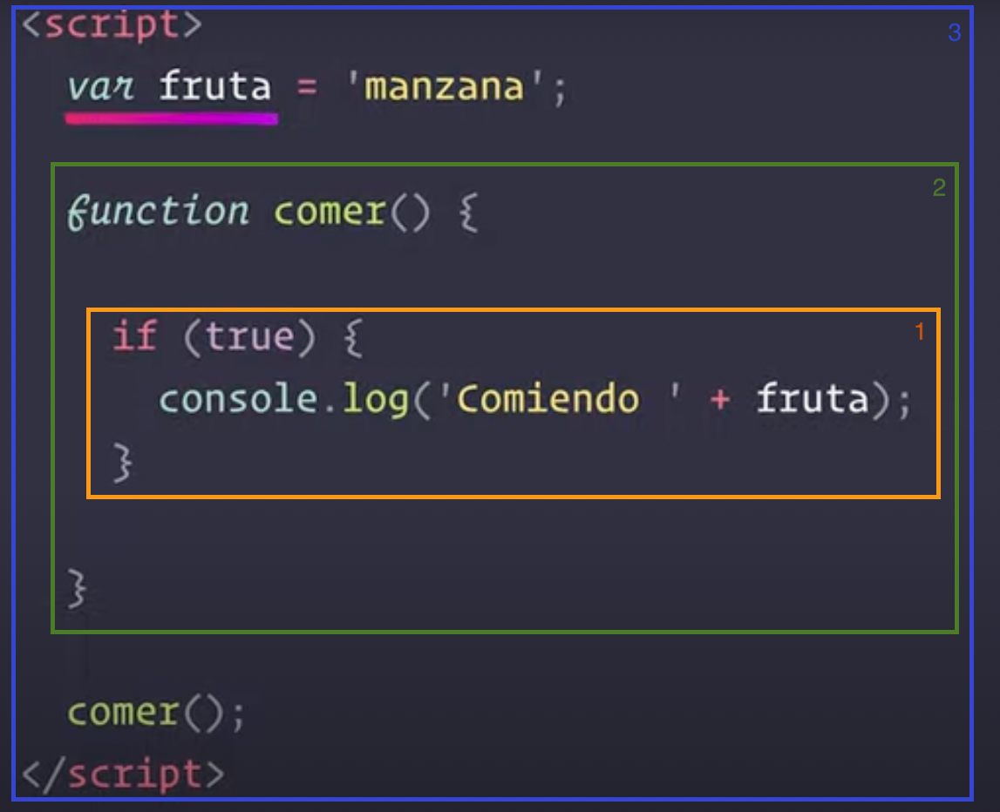
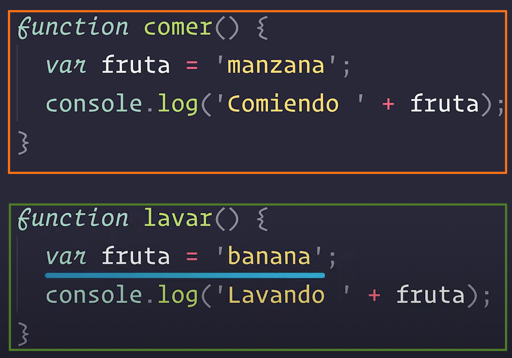
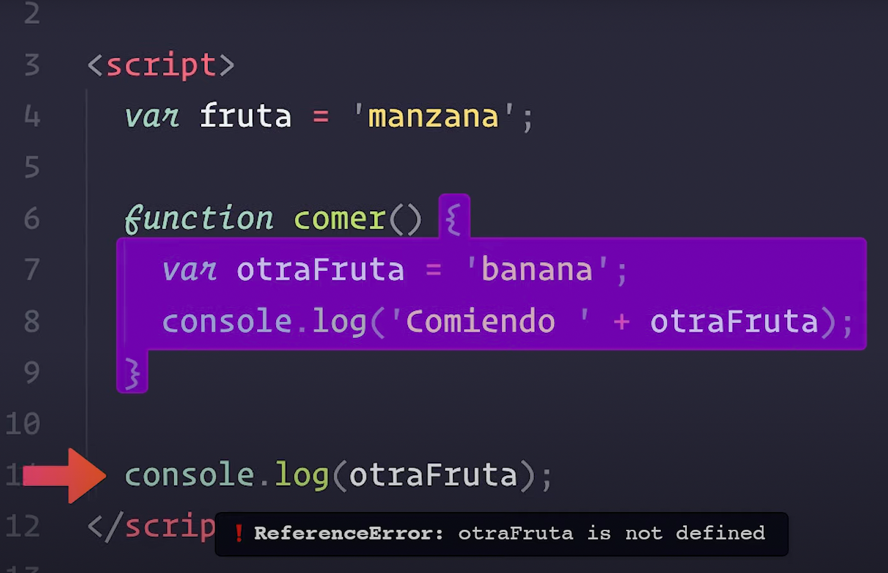
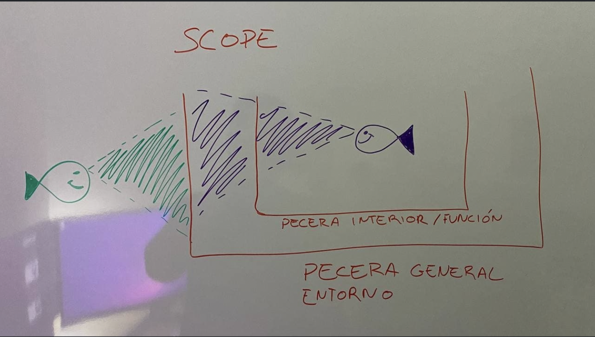

# JS functions

La estructura de una función en JS, por norma, es la siguiente:

```js
function <name> ([<parameters_list>]) {
  <instructions>

  [return <expression>;]
}
```

Los `parámetros` son todas aquellas variables que recibe la función al ser definida.

## Argumentos posicionales:

Los `argumentos` son las variables que necesita una función para `funcionar`. En la declaración de una función se indican cuántos argumentos necesitará y cual es el nombre de cada uno de ellos. Cuando invocamos la función se le añaden los valores que se le pasarán ala función.

```js
// Declaración de una función:
function saluda(nombre, lang) {
	console.log(nombre, 'bienvenid@');
}

// Invocación de una función:
saluda('Paco', 'es'); // esto recibe el nombre de invocación o llamada
```

Existe una distintición conceptual muy importante que es `argumentos VS parámetros`.

- Los `parámetros` son la lista de variables que ponemos `cuando se define una función`. En function saluda son `nombre` y `lang`.

- Los `argumentos` o `argumentos posicionales` son los valores que se pasan a la función `cuando ésta es invocada` ("Paco","es").

## Ejemplos

```js
function saluda(nombre, lang) {
	return console.log('Hola', nombre); //return undefined

	return 'code';
	return 'code2'; //unrecheable code
	throw new Error('idioma no implementado'); //programación defensiva
}
saluda('luis'); // lang es undefined en saluda() porque JS permite que falten argumentos posicionales (aunque no es lo recomendable).
console.log(saluda('luis')); //return undefined porque el return de la función devuelve el return de console.log('Hola', nombre)

function my_test() {}

my_test(); // no está asignada y no se muestra nada por pantalla, solo se ejecuta.
console.log(my_test()); // Se ejecuta primero la función. console.log pinta el return de la función.

var valor = saluda(); //Valor valdrá el return de la función saluda.
var valor = console.log('hola'); //vale undefined pero pinta hola por pantalla
```

- `CONCEPTO IMPORTANTE`: una función SIEMPRE devuelve algo. En caso de no tener return devuelve `undefined`.

- `console.log`: Es una función ya definida por JS que devuelve undefined.

## Function properties

`funciones`: para `reutilizar código` y `abstraernos` de lo que estamos usando (tener carnet de conducir pero no tener porque saber como funciona el motor de combustión interna).

- Separate the code in different parts
- `Reuse`
- `Abstraction`
- Single purpose
- Pure vs Impure: Avoid side effects

`console.log("Hola")` es una función que imprime el parámetro, pero `return undefined`.

> `JavaScript` (abreviado comúnmente JS) es un lenguaje de programación interpretado, dialecto del estándar ECMAScript. Se define como `orientado a objetos`,​ basado en `prototipos`, `imperativo`, `débilmente tipado` y `dinámico`.

`Tipado dinámico`: el tipo de una variable cambia. Es una caracterísitica de JS, las variables pueden tener el tipo que sea y pueden cambiar.

```js
var num = 1;
console.log(num); // 1
console.log(typeof num); // number
num = 'hola';
console.log(num); // hola
console.log(typeof num); // string
```

`Refactorización`: Reescribir código que ya funciona para poder hacer crecer en funcionalidades y que sea más mantenible en el tiempo (reduciendo así la deuda tecnológica).

## Annonymous functions

`funciones anónimas` en JS:

- BAD: No puede haber una función que no tenga nombre.

```js
function () {
  return "Hola";
}
```

- GOD: Pese a ser una función anónima podemos asignarla a una variable. Es decir, la función se comporta como un valor. Es decir, la propia variable se convierte en la función.

```js
// This is an annonymous function assigned to variable a
var a = function () {
	console.log('Hola');
};
```

- Se pueden asignar a variables. La propia variable se convierte en una función: `a()`.

```js
// DYNAMIC TYPE for variable a
a(); // Hola
console.log(typeof a); // function
a = 4; // Mediante tipado dinámico cambiamos el valor de una varibale (característica de JS).
console.log(typeof a); // number
a();
```

## Self-invoking functions

Lo que vemos a continuación es una `función anónima` no asignada a ninguna variable. En teoría no podríamos ejecutarla porque no podemos invocarla pero, gracias a los paréntesis la convertimos en una función autoejecutable.

```js
// This is a self-invoking function
(function () {
	console.log('Hola');
})();
```

## Expressions on function call

La palabra clave `function` puede ser usada para definir una función dentro de una expresión o variable. Veamos en detalle el siguiente ejemplo:

```js
const saluda = function (nombre) {
	return 'Hola ' + nombre;
};

// Un bucle for es muy típico de una variable de tipo array. En este caso, saluda a todos los nombres en a:
var a = ['Pepe', 'Juan', 'Luis', 'Paco'];
console.log(a);

for (var i = 0; i < a.length; i++) {
	saluda(a[i]); // Si usamos esta instrucción, sólo pinta el útlimo valor ya que la función saluda() devuelve un valor, pero no pinta nada.
}

for (var i = 0; i < a.length; i++) {
	console.log(saluda(a[i])); // Ahora sí que se muestran todos
}
```

De manera un poco más compleja, vemos como la siguiente función devuelve al media de un array de valores:

```js
function avg(a) {
	var media = 0;
	for (var i = 0; i < a.length; i++) {
		console.log(i, a[i]);
		media += a[i] / a.length;
	}
	return media;
}
avg([10 - 5, 2 * 2, (1 + 1) * 3]);
```

## Recursividad

La `recursión o recursividad` consiste en funciones que se llaman así mismas. Podemos llamar de manera recursiva a una función hasta la ruptura de stack (overflow).

```js
function saluda(arg) {
	console.log('Hola', arg);
	saluda('Pepe');
}

saluda('Pepe');
```

Cada llamada a una función (incluso así misma) genera una nueva entrada en la pila de llamadas (stack) del intérprete. Dado que la memoria del intérprete tiene un límite concreto es posible que si se hacen demasiadas llamadas se acabe produciendo un error o desvordamiento de llamadas (stack overflow).

Para evitar el overflow la función no decide por sí misma cuando parar. Nosotros le decimos cuando. Nosotros le damos a la función una condición conocida como `caso base`.

```js
let cuentaAtras = (numero) => {
	//base case
	if (numero === 0) {
		return;
	}
	console.log(numero);
	return cuentaAtras(numero - 1);
};
console.log(cuentaAtras(5)); // 5, 4, 3, 2, 1
```

> Ver [stackoverflow.com](https://stackoverflow.com/)

## Arguments

`arguments`: palabra reservada de JS para ver todo lo que recibe una función como argumentos.

```js
function saluda(nombre) {
	console.log(arguments); //[Arguments] {'0': 'Juan', '1': García}
	return 'Hola ' + nombre;
}

var p = [
	saluda('Juan', 'Garcia'),
	saluda('Luis', 'Pérez'),
	saluda('Paco', 'Porras'),
];
console.log(p);
```

## scope /scoping

El `SCOPE es el entorno o contexto de ejecución` dónde está declarada o definida una función o variable.

Cuando declaramos una variable, JS comanzará a buscar en el entorno más cercano y si no la encuentra irá ampliando hacia entornos más lejanos (1 < 2 < 3) hasta que encuentre la declaración de la variable `fruta`:



Cada uno de estos entornos recibe el nombre de scope y este da significado a las variables y determina el conjunto de variables a las que podemos acceder desde una línea de código.

> `El scope de cada variable dependerá de cómo y dónde declaremos la variable`.

Una variable declara en el scope global (función global) puede llamarse dentro de una función:

```js
var a = function (name) {
	console.log('Hello', name);
};

function amigo(amigo) {
	a(amigo);
}

amigo('Pepe');
```

> `Scope léxico` o lexical scoping: El scope de cada variable se determina leyendo el código del programa, sin ejecutarlo. También conocido como Scope estático o static scoping.

Una variable puede tener significados distintos dependiendo de su contexto. Es decir, dependiendo del contexto de ejecución el mismo identificador puede poseer información diferente:



Hay que tener claro que `contexto y contexto de ejecución son dos conceptos distintos`! El `contexto` es el valor que tiene la variable `this` en algún momento de la ejecución. Cuál es el objecto que está ejecutando una función. Cuando nor referimos a scope, nos referimos al `conexto de ejecución o entorno`.

- `Scope global`: las `variables globales` pueden ser accedidas desde cualquier lugar de nuestro programa. Se declaran fuera de toda función o bloque de código y no importa si las declaramos con var let o const. Las variables estarán en memoria durante toda la ejecución del programa.
- `Scope local`: las variables locales sólo se pueden accceder desd euna parte de nuestro programa. Las variables estarán en memoria durante la ejecución de la función. Dentro existen dos subtipos:
  - `Scope de función`: accesible dentro de toda la función, pero no fuera de la misma (siempre que las declaremos con var).
  - `Scope de bloque`: toda porción de código que está encerrada entre llaves {}. Accesibles dentro de todo el bloque, pero no fuera del mismo (si declaramos las variables con let y const).

Si intentamos acceder a una variable declarada en un scope local obtendremos un error (al igual que con los parámetros):



## Tipos de funciones según contexto

- `Funciones puras`: No depende del contexto donde se encuentre: dados unos datos devuelven algo (el valor de salida solo depende del valor de entrada). En este caso ojo siempre con las variables globales que trabajen con nuestras funciones.
- `Funciones impuras`: Dependiendo del contexto donde se encuentre puede variar los valores de retorno (menos recomendables).
- `Funciones deterministas`: el estado está determinado (si controlamos el resultado de la función).
- `Funciones no deterministas`: función cómo math.random().

> _Si tomamos el scope como peceras con la peculiaridad de que las paredes de estas pecera son como los cristales de los interrogatorios, es decir, `solo se ve desde dentro hacia afuera no de fuera hacia adentro`._
>
> _Veremos que desde una function multi() por ejemplo podemos ver variables del scope general o la pecera de fuera pero desde el scope general no podemos ver las variables declaradas dentro de una funcion._

```js
function multi(a, b) {
	var c = a * b;
	console.log(c);
}

var a = 14;
var b = 56;

multi(a, b);
console.log(c);
```



> [Jesús Silva Méndez](https://github.com/JesusSilva)

## Function scope

This is a `pure function`:

```js
function suma(a, b) {
	var c = 10;
	return a + b + c;
}
```

This is an `impure function`, it has side effects:

```js
// C is outside the function, in the global scope:
var c = 10;
function suma(a, b) {
	c++;
	return a + b + c;
}
console.log('La suma es ', suma(5, 7));
console.log('La suma es ', suma(5, 7));
console.log('La suma es ', suma(5, 7));
console.log('El valor de c es', c);
```

`Una función pura ayuda a prevenir efectos colaterales`. Otro tanto ocurre con las variables globales: cambiarlas puede llevarnos a errores en las funciones que dependan de ella por lo que es recomendable evitarlas.

## Default values on arguments

En caso de no pasar un argumento a la invocación de una función, se empleará un `valor por defecto`:

```js
function dado(caras = 6) {
	return Math.ceil(Math.random() * caras); // Math.random devuelve un valor entre 0 y 0.9999999...
}

dado();
dado(10);
```

```js
var a = Math.random() * 500; // El resultado será entre 0 y 499,999999
var a = Math.random() * 500 + 500; // El resultado será entre 500 y 1000
math.floor(); // Trunca los decimales al entero inferior
math.ceil(); // Trunca los decimales al entero superior
math.round(); // Redondea el valor

function randomizer(min, max) {
	return Math.random() * (max - min) + min;
}

randomizer(100, 600); // 600 - 100 == 500, que multiplicado por math.random dará un número entre 0 y 500 más el mínimo dará un número entre 100 y 600.

//cara tendrá un valor por defecto de 6
function dado(caras = 6) {
	return Math.ceil(Math.random() * 6); // Con Math.random() obtenemos un número entre 0 y 6, sin tocar el 6 (por eso usamos Math.celin())
}

dado(6);
```
